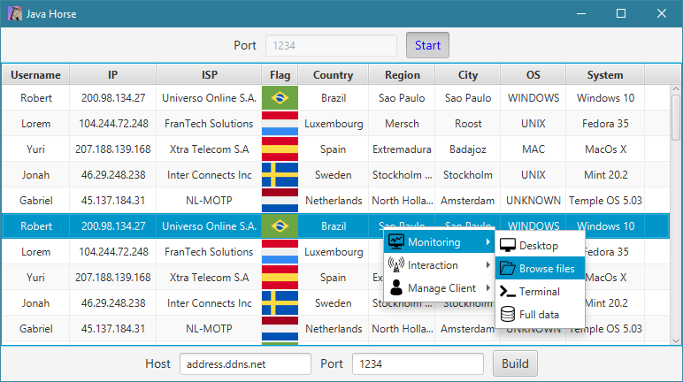

# Java Trojan
Fully Java powered trojan. Monitoring and communication software.

## Disclaimer
This project is for education purposes **ONLY**. If you are looking for spyware software, this is not it. Any other non-education use is disapproved.

## Running it
Java SDK 14+ is needed, although it is possible to reconfigure [pom.xml](pom.xml) and rebuild to use an older version. JavaFX is the limitation here.
Check the lastest build [here](/releases/latest)

## Features

### General
<figcaption align = "left"><i>Server-side UI</i></figcaption>

- Server-Client direct socket communication
- Port choosing
- JavaFX server-side UI, fast and nice-looking
- Table info UI organization
- slf4j logging

### Desktop Monitor

- Monitor selection
- Optional extra compression
- Sending mouse clicks and keyboard keys
- FPS counter

### File Browsing

- File extension icons
- File size
- Drive selection
- Running files on client-side
- Uploading and downloading
- Erasing files and folders

### Chat
<figcaption align = "left"><i>Server-side UI</i></figcaption>

<figcaption align = "left"><i>Client-side UI</i></figcaption>

- JavaFX on server-side, native javax.swing on client-side
- Client-side window closing prevention
- Minimalistic and objective UI

### Locking
<figcaption align = "left"><i>Client-side locked behavior</i></figcaption>

- Window closing prevention
- Screen obfuscation
- Mouse locked on corner
- Keyboard locked

### Data Query

- Local system data
- Network info from [ip-api.com](https://ip-api.com/)

### Terminal

- Remote terminal access
- Send commands, receive responses
- <figcaption align = "left">Platform dependency</figcaption>

  

### Building
<figcaption align = "left"><i>Done dialog</i></figcaption>

- Address selection (using no-ip or other ddns provider)
- Server classes removal from jar
- Useless files (images, .fxml) removal from jar
- Concurrent building in background
- <figcaption align = "left"><b>Only works when running from jar</b></figcaption>
  
  

### Turning off
- Remotely shut down client's machine
- A bit [platform dependent](https://stackoverflow.com/a/14297352/10421315)

